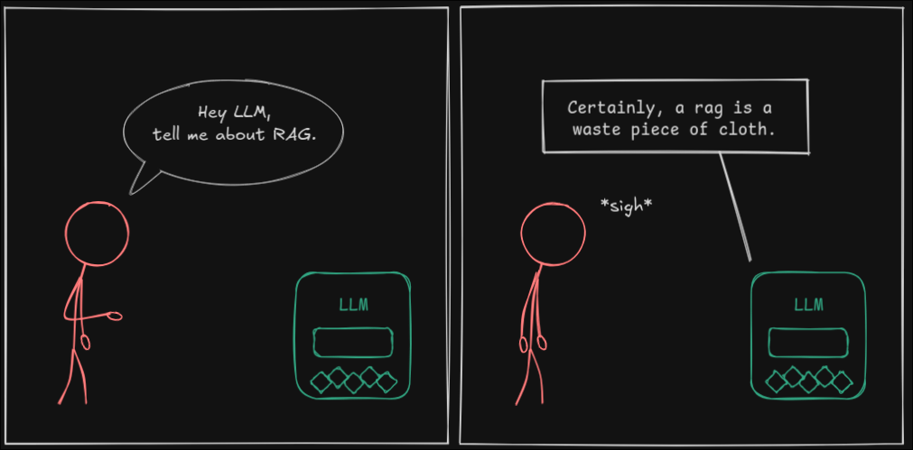
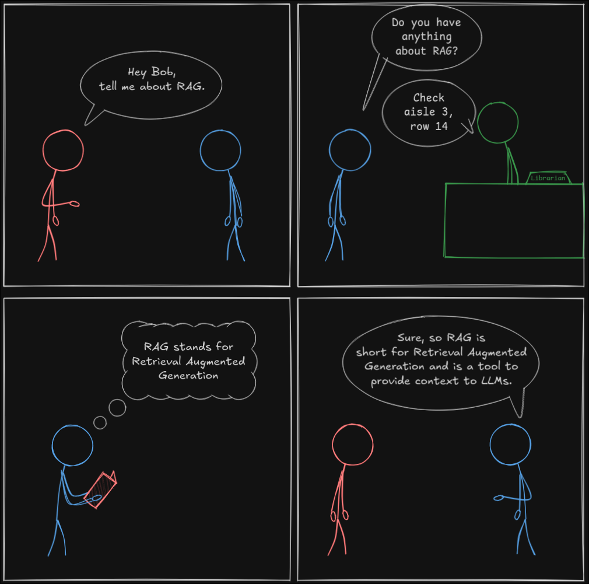
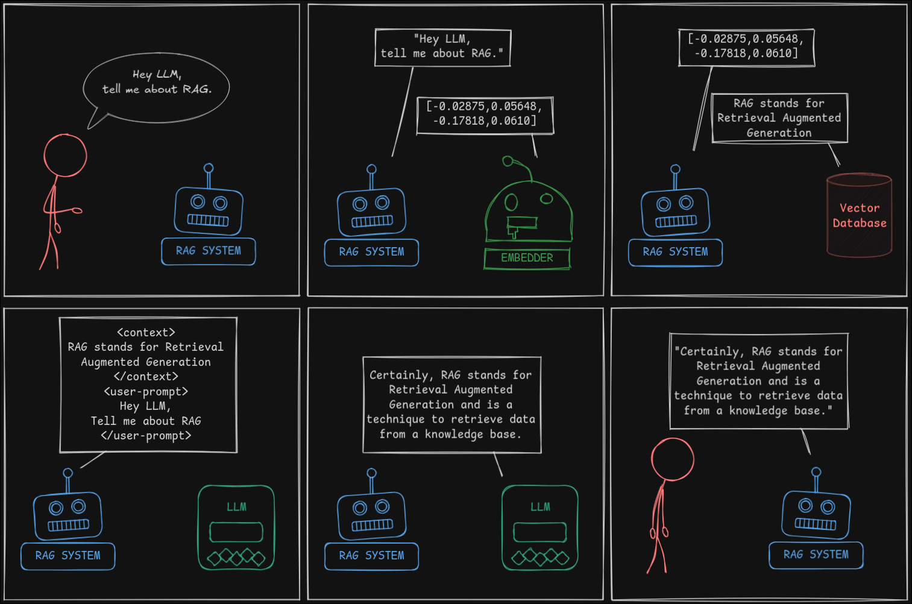
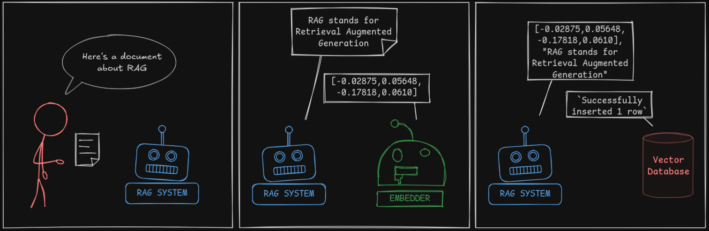
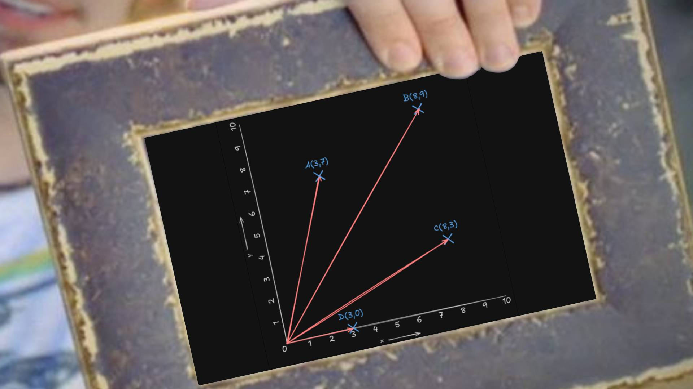
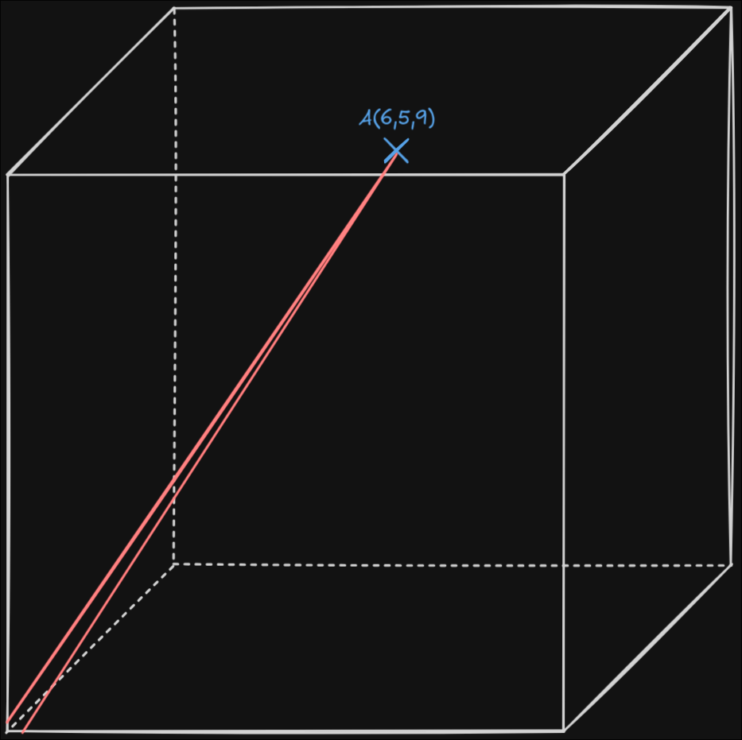
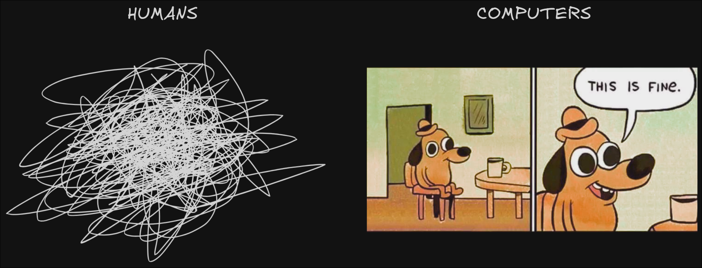
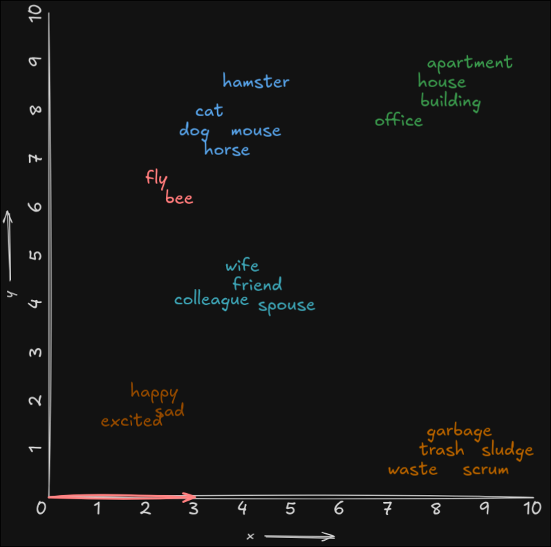
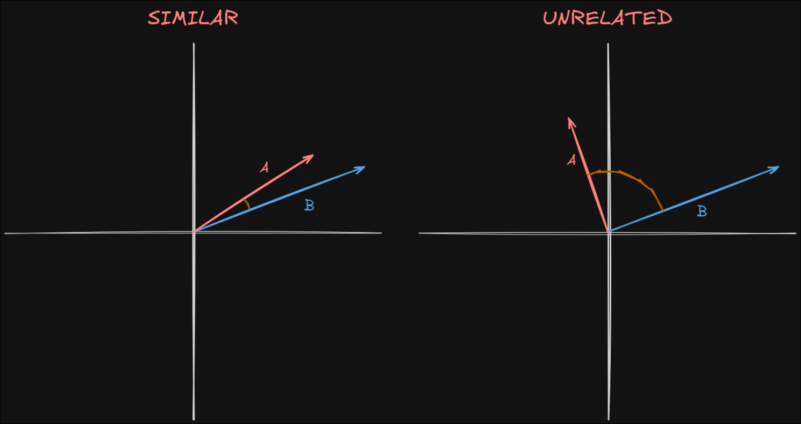
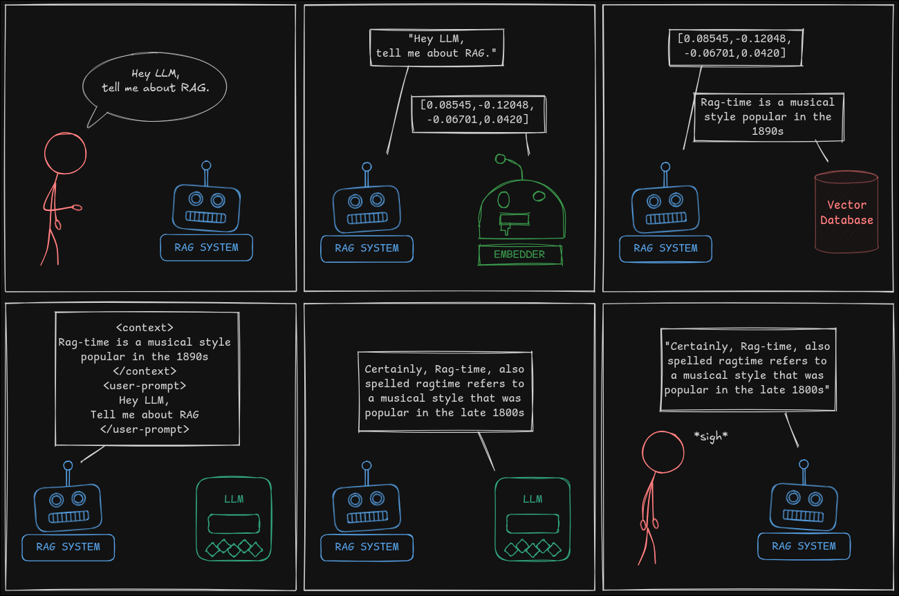

+++
title = "RAG Explained"
date = "2025-02-23T12:34:51+01:00"
#dateFormat = "2006-01-02" # This value can be configured for per-post date formatting
author = "DarkBones"
authorTwitter = "" #do not include @
cover = ""
tags = ["AI", "machine learning", "LLMs", "retrieval", "RAG"]
keywords = ["Retrieval-Augmented Generation", "RAG", "LLM prompting", "vector databases", "AI knowledge retrieval"]
description = "A beginner-friendly breakdown of Retrieval-Augmented Generation (RAG), how it works, and why it makes LLMs more powerful."
showFullContent = false
readingTime = true
hideComments = true
draft = false
+++
*Retrieval-Augmented Generation (RAG) enhances Large Language Models (LLMs) by enabling them to retrieve relevant information from external sources before generating a response. Because LLMs rely on static training data and do not update automatically, RAG provides a way to integrate fresh, domain-specific, or private knowledge without requiring costly retraining.*

*In this article, we will explore how RAG works, why it is useful, and how it differs from traditional LLM prompting. Expect oversimplified analogies, light technical deep dives, and a few poorly drawn diagrams to tie everything together.*

## RAG 

Large Language Models excel at many tasks. They can code, draft emails, hallucinate ingredients for the perfect sandwich, and even write articles, although I still prefer doing that myself. However, they have a major limitation. They lack real-time knowledge. Because training LLMs is a time-consuming process, they do not "know" about recent events. If you ask one about last week, it will either display a disclaimer, provide an outdated answer, or generate something completely inaccurate.

Some LLMs overcome this limitation by retrieving real-time data from external sources before responding. This approach, known as *Retrieval-Augmented Generationl (RAG)*, allows the model to fetch relevant information and incorporate it into the prompt before generating an answer.

## RAG - Oversimplified

But how does RAG actually work? Instead of looking it up ourselves, let’s ask our favorite LLM:


This is not quite what we were hoping for. No problem, we can ask Bob instead.


Surprisingly, Bob did not know the answer either, but he was able to retrieve it. Here is what happened:
1. We asked Bob about RAG.
2. Bob went to the library and asked the librarian for information.
3. The librarian pointed him to the right aisle.
4. Bob retrieved the information.
5. Now Bob sounds like an expert. Thanks, Bob.

This breakdown reveals that Bob is effectively functioning as a RAG agent. With that insight, let’s explore exactly how a RAG agent operates.

## RAG - Simplified

Let's transform our interaction with Bob into an actual RAG system:
- Bob represents the **RAG system**.
- The librarian acts as an **embedder**.
- The library functions as a **vector database**.



Instead of prompting the LLM directly, the user interacts with the *RAG system*. The *RAG system* then forwards the prompt to the *embedder*, which converts it into a *vector*. This *vector* is a numeric representation of the prompt. The idea is that information with similar meaning will have similar vector representations.

This vector allows the system to find relevant information in the vector database. When the vector representation of the user's prompt is sent to the database, it retrieves the most relevant matches.

The *RAG system* then enhances the user's prompt by including the retrieved information:
```
<context>
the information returned from the database
</context>
<user-prompt>
the user's original prompt
</user-prompt>
```

That is the entire process. Retrieve, Augment, and Generate. **RAG**.

However, the system cannot retrieve information that has not been added to the database. How do we store new data? The process is straightforward. Instead of using the vector to find relevant information, the system stores the data along with its vector representation.



If you were only interested in the big picture, congratulations. You now understand the core concept. However, if you're a fellow neckbeard, let's talk a bit more about vectors and embedders.

## What is a Vector?

In simple terms, a vector is a set of coordinates that describe how to move from A to B. Look at this graph:



This graph has two dimensions. Each point, **A**, **B**, **C**, and **D**, can be described using a two-number coordinate system. The first number tells us how far to move to the right from the origin (0), while the second number tells us how far to move up. To reach **A**, the vector is `[3, 7]`. To reach **D**, the vector is `[3, 0]`.

The same principle applies in three dimensions. To move from your desk to the coffee machine, you must travel a certain distance along the `x`, `y`, and `z` axes, forming a three-number coordinate system.



Humans struggle to visualize more than three dimensions, but computers do not have this limitation. The math remains the same. Four dimensions? That requires a *four-number* coordinate system. One hundred dimensions? That requires a *100-number* coordinate system.



The embedder I use operates in a coordinate system with 768 dimensions. When you have finished trying to visualize that, we can return to simpler, easy-to-draw, two-dimensional graphs.

### Why Are Vectors Useful?

Vectors by themselves are simply n-dimensional coordinates that represent points in n-dimensional space. Their usefulness comes from the information they represent.

In the same way, vectors are coordinates not to places, but to information. A specialized LLM, an *embedder*, is trained on a large corpus of text to figure out similarities and to place these pieces of information somewhere in n-dimensional space such that similar topics tend to be grouped together. Like, when you go to a social event, you're likely to stick with your friends, colleagues, or at least a group of like-minded people.



This graph shows how words that are similar in meaning tend to get grouped together in this n-dimensional space. Modern embedders (like **BERT**) don't use single-word embeddings anymore, but generate *contextual embeddings*.

The ability to group similar concepts in vector space makes embeddings powerful. However, early embedding models like *Word2Vec* had a significant limitation that modern models have addressed.

#### Quick Tech Tangent

If you've been working on AI systems for as long as I have, you might be familiar with **Word2Vec**. While groundbreaking when it came out in 2013, it has a major flaw: it assigns a **single vector** to each word, no matter the context.

Take the word *"bat"*.
- Are we talking about the **flying mammal**? Then it should be near *"mammal"*, *"cave"*, and *"nocturnal"*.
- Or do we mean a **baseball bat**? Then it belongs near *"ball"*, *"pitch"*, and *"base"* (but what *base*? Military?)
- And what if we're in the world of **fiction**? Then *"bat"* relates to *"vampire"* and *"transformation"*.

**Word2Vec** can't tell the difference. It picks one and sticks with it.

One thing I find particularly fascinating with Word2Vec is that, since words are now represented by numbers, you can actually do arithmetic on them.

You can make equations like 
`king - man + woman = queen`

It's wild, but it works (most of the time).

**Tangent over.**

### How are Vectors Used?

Now that we understand vectors, the next step is straightforward. We embed the information we want the LLM to access, and when we ask a question about that information, the question itself should be close to the relevant content in vector space. The vector database retrieves the `n` most relevant pieces of content, where `n` is a configurable number. It also returns the *cosine similarity* score for each result, indicating how closely the retrieved content matches the query.

Cosine similarity measures the angle between two vectors. A smaller angle indicates greater similarity, meaning the retrieved data is more relevant to the prompt.  



In our example, *A* and *B* represent the phrases *"RAG stands for Retrieval Augmented Generation"* and *"Hey LLM, tell me about RAG"*. Since they are closely related, their vectors are similar. If we instead ask *"Describe an Eclipse"*, its vector will be far from the others, making it unrelated. However, if *"RAG stands for Retrieval Augmented Generation"* is the only entry in the database, it will still be retrieved, even if it is not relevant to the query.  

## Limitations of RAG

Typically, we do not store and retrieve entire documents in the vector database. If we did, a single large document could easily exceed the context window of the LLM. If the system is configured to return the ten most relevant pieces of information, and each of them is the size of a full article, your computer quickly turns into a space heater. To prevent this, we split the information into chunks of a predefined size, such as `1000` characters, and we try to keep the sentences and paragraphs intact.

However, splitting information into chunks introduces a new problem. Just as *Word2Vec* struggles to determine meaning from a single word, RAG often fails to understand the full context of a single chunk, especially when that chunk is extracted from the middle of a document.  



Here is a problem I encountered recently. I keep a detailed work diary where I document all my professional achievements. It is extremely useful during performance reviews. However, when I ask my RAG system what I achieved at my current company, it confidently includes accomplishments from my previous jobs. Because I write this diary in the first person and also include information from other sources written in the first person, the system cannot distinguish between them. As a result, it starts attributing achievements to me that I had nothing to do with. That is how I realized something was wrong. My system was suddenly telling me about all the interesting things I supposedly did away from the computer, which is impossible since I never leave my desk.  

**Want to know how I fixed this mess?** In [the next article], I walk you through how I made my RAG system **context-aware**. You can even steal my code and set it up on your own computer with a couple of commands.

As I learned firsthand, retrieving information *does not guarantee understanding*. In [my next article](), I demonstrate how I made my RAG system **context-aware** so that it can truly comprehend the context of the data it retrieves.

## Conclusion

RAG makes LLMs more useful by letting them retrieve information they wouldn’t otherwise have access to. But it’s not magic. It comes with its own challenges, from handling context properly to avoiding irrelevant results.  

And as I found out the hard way, just because an AI can fetch information doesn’t mean it always understands it. In the next article, I’ll show you how I made my RAG system **context-aware**—so it actually knows what it’s talking about.
