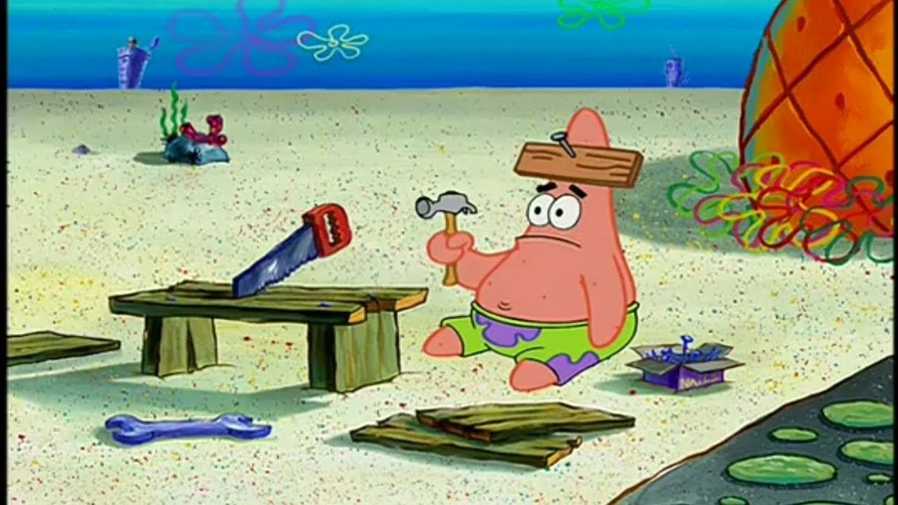

+++
title = "One Foot in the Unknown"
date = "2025-01-25T07:05:51+01:00"
#dateFormat = "2006-01-02" # This value can be configured for per-post date formatting
author = "DarkBones"
authorTwitter = "" #do not include @
cover = ""
tags = ["programming", "career", "tech", "burnout"]
keywords = ["software engineering", "learning", "growth"]
description = "A journey through the phases of learning and growth in software engineering, from knowing nothing to thriving in chaos."
showFullContent = false
readingTime = true
hideComments = true
draft = false
+++
**Maybe it's because I'm self-taught and didn't start coding professionally until eight years into my now 13-year journey and I never truly got over feeling like I'm "not good enough yet to get paid for writing code". Perhaps it's pure passion—or even a touch of masochism. Whatever the reason, I embrace a little chaos in my life.**

**No matter how you got here—whether with a CS degree, learning everything on YouTube, attending a bootcamp, or, like me, tinkering on personal projects as if your life depended on it—we all start at the same place: Knowing. Absolutely. Nothing.**

## Phase 0: Knowing Nothing

This phase is as uncomfortable as it is frustrating. One moment, you're on the verge of giving up; the next, you're desperately waiting for that breakthrough when everything finally clicks. Sometimes, you even experience both at once.

The good news is that you don't have to stay in that place forever. The better news is that you can.

## Phase 1: Knowing "Something"

At first, you learn to do something very basic—like writing a program that prints "Hello World!" to a console. It's a small win, but it's your first taste of what coding can do.

Then, sooner or later, you get an opportunity to put that simple skill to work. Maybe it's a task from your boss, a class assignment, or a requirement in your personal project: printing a line of text to a console. When you get to do that task, your heart leaps with joy. You create a new branch, implement the solution, push it to the repo, and suddenly, everyone can see that little victory. In that moment, you feel like a real engineer.

I remember feeling like I was on top of the world—at the summit of mount stupid—after learning about `if` statements. I thought, "Programming is just about writing a bunch of `if` statements to decide whether to do `x` or `y`."

But, alas, not every task is as simple as printing a line of text or toggling between `x` and `y`.

## Phase 2: The Perceived Valley of Despair

Eventually, all who reach the summit of mount stupid must take that inevitable slide down into the valley of despair.

As you tackle more tasks and get better at suppressing the thoughts of giving up, you also discover more layers to the craft. You become partly capable of handling your job or project, yet with every new concept mastered, five more emerge that you **previously** didn't know existed. Upon realizing each of those five things come with their own five things you **currently** don't know the existence of, the thoughts of quitting might grow a little stronger.

> Turns out, a good application is more than a bunch of `if` statements. Who knew?

Every question you ask only seems to spawn more questions. If you're fortunate enough to have a mentor during this phase, you might worry that you're asking too much—fearing you're becoming a burden. And if you're lucky enough to have a good mentor, rest assured, they've been there too.

It might seem similar to Phase 1, but don't be fooled. This is a whole different beast. Here, you stand with one foot firmly in the chaos of the unknown and the other planted in the comfort of the familiar.

> I know how to write this `if` statement. And I know how to write a class. But where do I put it? And how do I import it in the other class? And why is my PR rejected with a comment about 'early returns'? And what is an 'early return'? Why do we care about 'performance' so much? It seems fast enough when I run it on my machine...

## Phase 3: Knowing Almost All The Things

While you’re busy nurturing the foot that’s still in chaos, you might not notice that the area of the familiar is quietly expanding beneath the other. And before you know it, you’re firmly planted in comfort. Welcome to being: "A pretty good engineer". You might feel a sense of pride—after all, new tasks no longer fill you with dread because you believe you can handle almost anything the job throws at you.

Sure, you’ll still occasionally be stumped by something new or confusing. But hey, who isn’t?

I thought infrastructure was just messy and confusing. Fortunately, we had an infrastructure guy at work, so I never had to worry about setting up Helm charts or poking around in AWS. That's what infrastructure guy™ is for!

A sense of peace—one you never realized you never wanted—begins to settle in.

## Phase 4: Knowing More Than You Need

Of course, production goes down on the same day that infrastructure guy™ starts his 4-week PTO. "Okay, no need to panic," you tell yourself. "What did he say during standup the other day? Something about a Kubernetes cluster? I'll take a look."

Great, our sales department has an exciting lead for a big Swiss customer! Wait, what's that? They're required by law to have all their data in Switzerland? But our database is... in the Cloud? Unless that Cloud is permanently hanging over Zurich, we need to either move our data to Switzerland or set up a separate database there and configure the app to somehow use this other database. Where's infrastructure guy™? Oh right, that was two jobs ago.

Even though you no longer see yourself as being in a "learning phase," knowledge continues to accumulate through adversity. You’ve moved from "knowing enough to handle your daily tasks" to knowing way more than that.

> I'm **still** required to learn things? This is BS! I should be cruising, adding years of experience, salary bumps, and fancy titles!

That creeping sense of peace eventually turns to dread. Did I lose my passion for tech? Did I trade disassociating at my desk in a call center for disassociating at my desk in a tech firm? Is this really what I worked so dang hard for? What am I going to do for the next 30 years of my life? Is it CRUD operations forever?

## Deceived by Comfort

While mentoring a small team of junior developers, I began to envy how much they were still learning. I found myself wishing I could go back to that exhilarating “Phase 2”—when you’re in the zone, challenged enough to notice improvement from one week to the next.

I thought, if mentoring juniors is the final destination, I might as well get really good at it. So I turned to YouTube for inspiration and ended up finding tech influencers like [ThePrimeagen](https://www.youtube.com/@ThePrimeTimeagen), [tjdevries](https://www.youtube.com/@teej_dv), and [typecraft](https://www.youtube.com/@typecraft_dev). They’re still burning with passion for programming. Where does that spark come from?

I saw them using tools like Neovim and Arch Linux (I now also use Arch Linux, by the way), advocating for proper typing, and relentlessly learning new things. And that’s when it hit me—I could be just like those junior engineers. And I could *start today*.

## Phase 2: The Perceived Valley of Despair. Again.

Even when you think you’ve escaped the perpetual learning cycle, sometimes life pulls you right back into that familiar valley of questioning.

You do not know all the things. Nobody in tech knows everything—it’s impossible to know it all. That's not a bug; it's a feature.

If you're bored with the comfort of familiarity, all you have to do to get back into Phase 2 is *move your feet*.

But what can you do when you're tired of adding yet another set of CRUD endpoints to an API?

### Treat It Like A Video Game

What do you do when you get bored of a video game but can't find something else to play? Try one or more of these:

- **Speedrun it.**
- **Use a different editor.**
- **Install mods (a.k.a. Neovim plugins).**
- **Make your own mods.**
- **Automate it.**
- **Rewrite it in Rust.**
- **Do it branchless without a single `if` statement.** (Phase 1 me would have cried at the thought.)
- **Become infrastructure guy™.**

It also helps to be mindful about tiny frustrations that come up from time to time. Typing a long command in your terminal and realize you made a typo at the very start? You can either hold the left arrow key for five minutes or look up how to get to a specific part of a command more efficiently in the same amount of time.

### Do Something Else Entirely

Are you a frontend engineer? Try backend. A backend engineer? Experiment with frontend. Full-stack? Build a video game. A game engineer? Create a text editor. For that matter, consider:
- Git gud at LeetCode.
- Learn to type faster.
- Build an embedded system.
- Learn Assembly.
- Start giving tech talks at work.
- Find out what BTRFS is and how it works.
- Experiment with writing a graphics shader.
- Build an AI using nothing but LSTM, feed it Christmas songs in LilyPond format, and play the generated tunes at your Christmas dinner party to the annoyance of your guests.
- Contribute to open source projects.
- Participate in a data science competition at CERN with LHC data (I got surprisingly far).
- Build your own text editor.
- Automate your house—make it track how many Chocolate Peanut Butter Oreos you have in the cupboard so you never run out again.

It's okay to fail at half of these things. It's okay to only attempt a few. The only way to lose is by becoming too comfortable for too long.

### *"Is it just learning forever?"*

Yes.

### *"What if I get tired of learning?"*

If you get tired of having one foot in the known and the other in the unknown, be kind to yourself. Take a little break. A little vacation, if you will. It's okay. Everyone needs a break sometimes and you deserve it. Put **both** feet in the unknown. Go back to Phase 0. Switch to DVORAK, install Arch on your MacBook, fire up Emacs and do last year's Advent of Code in Rust with it after putting ChatGPT in the blocklist of your pi-hole. Embrace the suck. See how fast you can get to Phase 2 again with that setup. Do that before considering taking a vacation in the place of boredom.

## The Takeaways

One of the greatest perks of being a knowledge worker is that our job lets us constantly learn cool new things. If you're an engineer—or any kind of knowledge worker—you've already traveled the journey from knowing nothing to where you are now. Maybe you're content to coast until retirement, and that's perfectly fine. But for me, coasting leads to boredom, and boredom leads to burnout.

As knowledge workers, knowledge is value, and we share that value freely and willingly. When I submit a PR that I poured my heart into—only to have a colleague suggest an obviously better strategy that sends me back to square one—I'm thankful every single time. I now know one more thing and that's valuable.

The goal isn’t to know everything—it’s to enjoy not knowing and keep learning anyway.

Even though some might see me as some kind of wizard (my monitor seems to flicker with code, windows pop in and out of existence until I miraculously raise a PR while my hands never left the keyboard), I still get overwhelmed when I look at the giant, ever-growing list of things I still want to learn. And that, in itself, makes me happy.

