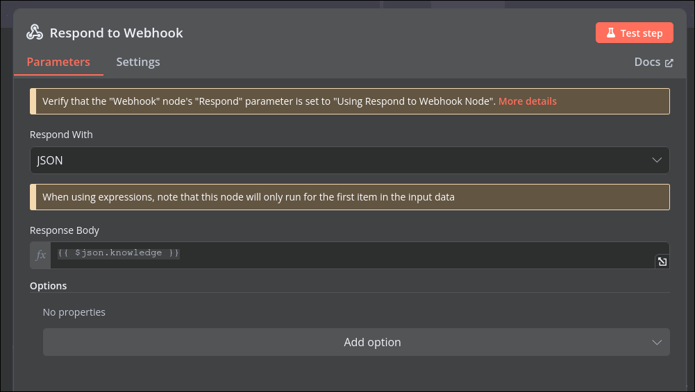

+++
title = "You're Doing RAG Wrong: How to Fix Retrieval-Augmented Generation for Local LLMs"
date = "2025-02-25T16:55:55+01:00"
author = "DarkBones"
authorTwitter = "" #do not include @
cover = ""
tags = ["AI", "machine learning", "LLMs", "retrieval", "self-hosting", "RAG", "vector databases", "local AI", "context-aware AI", "RAG troubleshooting", "RAG setup", "RAG optimization"]
keywords = ["Retrieval-Augmented Generation", "RAG", "local AI", "vector databases", "context-aware AI", "RAG troubleshooting", "fix RAG issues", "improve RAG retrieval", "self-hosted RAG", "context blindness RAG", "first-person confusion RAG", "RAG setup tutorial", "local LLM RAG", "Ollama RAG"]
description = "Struggling with Retrieval-Augmented Generation (RAG)? Learn how to fix context blindness, first-person confusion, and optimize retrieval for local LLMs. Step-by-step guide with open-source tools."
showFullContent = false
readingTime = true
hideComments = true
draft = true
+++

> How To Set Up RAG Locally, Avoid Common Issues, and Improve RAG Retrieval Accuracy.

✔️ **Want to skip straight to the setup? [Jump to the tutorial](#setting-it-all-up).**

✔️ **Need a RAG refresher? [Check out my previous article]().**

> **RAG Works... Until It Doesn't**

**RAG sounds great, until you try implementing it. Then the cracks start to show.**

RAG pulls in **irrelevant chunks**, **mashes together unrelated ideas**, and **confidently misattributes first-person writing**, turning useful context into a confusing mess.

# How to Make RAG Smarter
other interesting
I ran into two major issues when building my own RAG system:
- 🧩 **Context Blindness** – When retrieved chunks don’t carry enough information to be useful.
- 🤦 **First-Person Confusion** – When the system doesn’t know who "I" refers to.

I'll show you exactly how I **fixed these problems**, so your RAG system actually understands what it retrieves.

By the end, you'll have a **100% local, 100% free, context-aware RAG pipeline** running with your preferred local LLM and interface. We'll also set up an **automated knowledge base**, so adding new information is *frictionless*.

# Before we get started...

Enjoying this deep-dive? Here's how you can help:
- 👏 **Clap for this article** – It helps more people find it.
- 🔔 **Follow me** – I write about AI, programming, data science, and other interesting tech. More posts like this are coming!
- 💬 **Leave a comment** – Have you struggled with RAG? Found a better way to chunk data? Let's talk!

# 🧩 RAG Problem #1: Context Blindness

Let's say my vector database holds detailed plots of two wildly different movie series: *The Matrix* and *The Lord of the Rings*. For simplicity, we're using **small chunks with no overlap**.

Each plot is split into sentences and stored as **embeddings in a vector database**. This should work well, right? ...Right?

## What Happens When We Query the Database?

Let's see what happens when we ask a few questions.

```
Input:  Who forged the One Ring and why?
Output: [
  "Sauron forged the One Ring in Mount Doom to control Middle-earth.",
  "The One Ring was made to enslave Elves, Dwarves, and Men.",
  "Neo is believed to be the One who will save humanity.",
  "Morpheus was on a mission to find The One.",
  "The One is a prophesied figure destined to bring balance and end the war."
]
```

```
Input:  Who or what was the Oracle in The Matrix?
Output: [
  "The Oracle is a program in the Matrix that guides Neo on his path."  ,
  "Galadriel, the Lady of Lothlórien, offers wisdom and foresight to the Fellowship.",
  "The Oracle helps humans understand their choices within the Matrix.",
  "Gandalf is a Maia, sent to Middle-earth to guide and counsel its people.",
  "The Oracle predicts the coming of the One who will end the war."  
]
```

Now, let's feed this context to an **LLM** and see what it generates.

---

**Input:**

*Who forged the One Ring and why?*

**LLM Response:**  

*The One Ring was forged by Sauron and Agent Smith to control Middle-earth and enslave Elves, Dwarves, and Men. Neo is believed to be the One who will save humanity, ignoring the other races. Sauron tricked the Elves into helping, while Agent Smith just wanted to destroy both humans and the Matrix.*

---

**Input:**

*Who or what was the Oracle in the Matrix?*  

**LLM Response:**  

*The Oracle is a program in the Matrix that guides Neo on his path, much like Galadriel, the Lady of Lothlórien, who offers wisdom and foresight to the Fellowship. Together, they predict the coming of the One who will end the war, by throwing the Matrix into Mount Doom.*

---


## What Went Wrong?

> Garbage in, garbage out.

- The **vector database isn't smart**, it just sorts by similarity.
- It doesn't **know what a "movie" is** or that *The Matrix* and *The Lord of the Rings* are different stories.
- **"Oracle"** is a vague term, so it retrieves Galadriel too.
- The LLM **blindly accepts the context**, mashing concepts together into nonsense.

The retrieved chunks **lack broader meaning**, causing **irrelevant mashups and hallucinations**.

> In fact, we might have been better off **giving the LLM no context at all**.

This is **Context Blindness** and it's why naive RAG implementations often do more harm than good.

# 🤦 RAG Problem #2: First Person Perspective Confusion

I write a lot in the first person. **Articles**, **technical documentation**, **talk preparations**, **emails**, and a **professional diary** tracking my work and achievements.

But my knowledge base doesn't just store *my* writing. It also holds:
- **Articles** I saved for later
- **Documentation** for tools I reference
- **Other resources**, all mixed together

But when a query retrieves these chunks, how would an LLM know which one is actually about me?

> "I designed a robust data anomaly detection system."
> 
> "I climbed Mount Fuji in the least amount of steps."

Obviously, it's the former, but a vector database has no way of knowing that.

# 🛠️ Solving Context Blindness with Context-Aware Chunks

Storing **raw chunks** isn't enough. Even humans struggle to understand isolated sentences without context, so why would a vector database do any better?

> We need to make each chunk **context aware**.

## Before vs. After: A Smarter Chunk

Here's a **raw chunk** from our example:

> The Oracle is a program in the Matrix that guides Neo on his path.

And here's a **context-aware** version:

```
<file_summary>
This file contains a detailed explanation of the Matrix film trilogy.
</file_summary>

<chunk_summary>
This chunk contains details about the character "The Oracle".
</chunk_summary>

<chunk_headers>
# The Matrix, ## The First Movie, ### Notable Characters, #### The Oracle
</chunk_headers>

<chunk_content>
The Oracle is a program in the Matrix that guides Neo on his path.
</chunk_content>
```

Even if you don't know The Matrix or The Oracle, this **clarifies** what the chunk is about.

## 🔍 How Do We Generate Context?

We **ask an LLM** to summarize the document using **key chunks**:
1. **File Summary** -> Based on **intro & conclusion** (where the key context usually lives).
2. **Chunk Summary** -> Tied back to the broader document.
3. **Headers** -> Extracted from markdown.

We store everything in a **new database field**:
- **The *full_context* field** -> This is what we **vectorize & embed**.
- **The original chunk (with headers)** -> This is what the database **returns**.

## 🎯 Why This Works

By embedding **context**, we **improve retrieval**:
- ✅ The system knows what the chunk is about.
- ✅ It retrieves fewer irrelevant chunks.
- ✅ The LLM gets better context, reducing hallucinations.

This isn’t just useful for movie plots—it’s essential for legal documents, technical knowledge bases, and enterprise AI.

> A simple fix, but a *massive improvement*.

## 📦 Why NOT Return the Context?

The added context **only helps retrieval**, the LLM **doesn't need it**.

To keep file processing **fast**, I use a **lighter LLM** to summarize chunks. It makes **plenty of mistakes**, but the **vector database doesn't care**. It still manages to correctly spot which chunks are most relevant.

But if the LLM actually reads those mistakes? Now it's the one getting confused.

### Smarter Retrieval, Cleaner Responses

Instead of feeding the LLM **messy, error-prone summaries**, we:
- ✅ **Only return the original chunk**, not the generated context
- ✅ **Minimize token usage** and avoid wasting compute
- ✅ **Speed up processing** by skipping unnecessary re-summarization

This way, **retrieval gets smarter** without turning the response into a hallucinated disaster.

# 🤦 Solving First-Person Confusion

The fix for this is simple, but a little hacky.

I keep a directory in my knowledge base with my first name. If the chunk processor detects a file from this directory (or any of its subdirectories), it **modifies the prompt** to ask the summarizing LLM:

- It is explicitly instructed to **make it abundantly clear that this text is written by me.**
- It replaces generic references like *I*, *me*, and *my* with my **full name** in the summary.

Before querying the vector database, I **prepend my full name to the prompt.**

> John Doe: What is my PB in the 5k?

Sure, it's not the most elegant fix, but it works. And in any system, **simple and effective beats complex and fragile**.

By clarifying authorship at the summarization stage, the system can finally **tell the difference** between my achievements and that travel blog I saved about climbing Mount Fuji.

# 🛠 Setting it all up

To set up this system locally, you need the following components:

- **Database** -> *PostgreSQL*
- **Local LLM interface** -> *Ollama*
- **LLMs** -> I recommend `qwen2.5` / `deepseek-r1` / `llama3`, whatever suits your needs and hardware
- **Embedder** -> `nomic-embed-text`, or any embedding model you prefer
- **UI for interaction** -> I recommend *open-webui*
- **Vector database** -> *Supabase*
- **RAG system** -> *darkrag* (my own)
- **Automation** -> *n8n*, or any similar system of your preference

Everything runs in **Docker containers**. If you're new to Docker, check out some beginner guides before proceeding.

I run my containers on a **custom Docker network** (`ai-network`) so they can communicate without manual configuration.

I run **Arch Linux**, so I created **systemd daemons** in `~/systemd/.config/systemd/user/`, but this setup is adaptable for *Windows*, *macOS*, and other *Linux* distributions. Instead of using a large `docker-compose` file, I **run containers separately** so I can enable/disable components as needed to free up memory.

## 🚀 Setting up Ollama and downloading LLMs

Run the following command to start **Ollama**:

```
/usr/bin/docker run --rm \
    --network=ai-network \
    --name ollama \
    -v ollama_models:/root/.ollama/models \
    -p 11434:11434 \
    ollama/ollama:latest
```

> **Note:** the volume `ollama_models` is mapped to `/root/.ollama/models`, ensuring models persist even after shutting down the container.

Once **Ollama** is running, enter the container:
`docker exec -it ollama /bin/bash`

Inside the container, pull the necessary models:

```
ollama pull qwen2.5
ollama pull nomic-embed-text
```

Then exit back to your local machine:
```
exit
```

## [Optional] Running Ollama as a Daemon

If you want **Ollama to start automatically** when you log in, create a **systemd service** or whatever the equivalent for your OS is:

```systemd
; systemd/.config/systemd/user/ollama.service
[Unit]
Description=Ollama AI Model Server
After=default.target
BindsTo=default.target

[Service]
ExecStartPre=-/usr/bin/docker network create ai-network
ExecStart=/usr/bin/docker run --rm \
    --network=ai-network \
    --name ollama \
    -v ollama_models:/root/.ollama/models \
    -p 11434:11434 \
    ollama/ollama:latest
ExecStop=/usr/bin/docker stop ollama
ExecStopPost=/usr/bin/docker rm ollama

Restart=always
RestartSec=5

[Install]
WantedBy=default.target
```

Enable it with:

```
systemctl --user enable --now ollama
```

## 📦 Setting Up PostgreSQL

Run the following command to **start a PostgreSQL container**:

```
/usr/bin/docker run --rm \
    --network=ai-network \
    --name=postgres \
    -p 5432:5432 \
    -v ~/Apps/postgres:/var/lib/postgresql/data \
    -e POSTGRES_USER=user \
    -e POSTGRES_PASSWORD=password \
    -e POSTGRES_DB=default_db \
    postgres:16-alpine
```

Replace `user` and `password` with your desired credentials

## 🖥️ Setting Up Open-WebUI

Open-webui provides a **ChatGPT-like UI** for local models.


Start it with:

```
/usr/bin/docker run --rm \
    --network=ai-network \
    -e OLLAMA_BASE_URL=http://ollama:11434 \
    -e PORT=4080 \
    -p 4080:4080 \
    -v /path/to/your/conversations/on/your/machine:/app/backend/data \
    --name open-webui \
    ghcr.io/open-webui/open-webui:main
```

> **Note:** Replace `/path/to/your/conversations/on/your/machine` with the actual path on your local machine you want the database to live.

### Configuring Open-WebUI Functions

Navigate to `http://localhost:4080` and go to:

`Settings > Admin Panel > Functions`

- Create a **new function**
- Enable it by clicking the **three dots > Enable Global**
- Alternatively, enable it per model in `Model Settings`

Use the following function script:

[Open-Webui Webhook Function](https://github.com/DarkBones/darkrag/blob/main/open-webui-webhook-function-example.py)

## 🗄️ Setting Up Supabase

Follow the official guide to [self-host Supabase with Docker](https://supabase.com/docs/guides/self-hosting/docker)

Then, update your `docker-compose.yml` file to use the `ai-network`:

[Supabase customized docker-compose](https://github.com/DarkBones/darkrag/blob/main/supabase-docker-compose-example.yml)

## [Optional] Running Supabase as a Daemon

For my own setup, I cloned the **Supabase** repository in my `~/Apps` directory and run it with this daemon:

```systemd
; systemd/.config/systemd/user/supabase.service
[Unit]
Description=Supabase
After=docker.service
BindsTo=default.target

[Service]
ExecStartPre=-/usr/bin/docker network create ai-network || true
ExecStart=/usr/bin/docker compose -f %h/Apps/supabase/docker/docker-compose.yml up
ExecStop=/usr/bin/docker compose -f %h/Apps/supabase/docker/docker-compose.yml down

Restart=always
RestartSec=5

[Install]
WantedBy=default.target
```

#### Configuring Supabase

Go to:

`http://localhost:8000`

Find your **username and password** in `.env` from the Supabase repo.

In the *SQL editor*, run:

```sql
CREATE SEQUENCE documents_id_seq;

CREATE TABLE documents (
    id BIGINT PRIMARY KEY DEFAULT nextval('documents_id_seq'),
    content TEXT,
    metadata JSONB,
    embedding VECTOR(768),
    content_hash TEXT DEFAULT 'placeholder'::text,
    summary TEXT DEFAULT 'placeholder'::text,
    full_context TEXT DEFAULT 'placeholder'::text
);
```

To enable **vector search**, create a similarity function:

```sql
create or replace function match_documents(
  query_embedding vector,
  match_count int
) returns table (
  id uuid,
  content text,
  metadata jsonb,
  similarity double precision
) language plpgsql as $$
begin
  return query
  select
    id,
    content,
    metadata,
    1 - (documents.embedding <=> query_embedding) as similarity
  from documents
  order by documents.embedding <=> query_embedding
  limit match_count;
end;
$$;
```

We also need a way to remove data from the database by the *"file_path"* key in the metadata. This way we can avoid having duplicate entries for the same documents. Run this in the *SQL editor* to create that function:

```sql
create or replace function delete_documents_by_path(
  target_path text
) returns void 
language plpgsql as $$
begin
  delete from documents 
  where metadata->>'file_path' = target_path;
end;
$$;
```

## 🛠 Setting up darkrag

By default, *darkrag* is designed for Markdown files because my knowledge base is mostly structured notes, documentation, and saved articles. However, if you work with other formats, like PDFs, plain text files, or even web pages, you can easily modify the file processing logic to support them.

Pull the **darkrag** image:

```
docker pull darkbones/darkrag:latest
```

Create an `.env` file (e.g., `~Apps/darkrag/.env`):

```sh
# .env
DEFAULT_DATABASE_TABLE=documents
AUTHOR_NAME=John
AUTHOR_FULL_NAME="John Doe"
AUTHOR_PRONOUN_ONE=he
AUTHOR_PRONOUN_TWO=him

SUPABASE_URL=http://kong:8000
SUPABASE_KEY=your-supabase-key-as-found-in-your-supabase-env-file

OLLAMA_URL=http://ollama:11434
DEFAULT_MODEL=qwen2.5:7b
EMBEDDING_MODEL=nomic-embed-text:latest
```

*Important variables:*
- `AUTHOR_NAME`: For any file in the `AUTHOR_NAME` directory, or any of its sub-directories, *darkrag* will prompt the chunk summarizer to replace all first-person references like *"I"* or *"me"* with your full name, to solve the *"first-person confusion problem"*. For example, if a file in `your-knowledge-base-directory/John/about-john.md` contains `I like trains`, the chunk summarizer will add something like *"John Doe likes trains"* to the contextualized summary of the chunk.
- `AUTHOR_FULL_NAME`: Your full name so *darkrag* can contextualize first-person chunks.
- `AUTHOR_PRONOUN_ONE` & `AUTHOR_PRONOUN_TWO`: Needed for the prompt to contextualize first-person chunks.
- `SUPABASE_KEY`: Needed to connect to the **Supabase** instance. You can find this key in your `.env` file of **Supabase**.
- `DEFAULT_MODEL`: The LLM that will summarize the chunks. I recommend `qwen2.5:7b` as it's light-weight and accurate enough.

Replace the variables with actual values as needed.

Finally, run this command to run *darkrag*:

```
docker run --rm \
  --env-file [path-to-your-env-file] \
  --network=ai-network \
  --name=darkrag \
  -v /mnt/SnapIgnore/AI/knowledge:/data \
  -p 8004:8004 \
  darkbones/darkrag:latest
```

Just remember to replace `[path-to-your-env-file]` with the actual path to your `.env` file you created above. If you prefer, you can also provide the environment variables in the `docker-run` command directly if you prefer that over using an `.env` file.

## 📡 Setting Up n8n for Workflow Automation

Now that we have all the individual pieces, it's time to **connect everything**.

If you're unfamiliar with *n8n*, it's a **low-code automation tool** that helps integrate different services.

We'll use it to:

- **Monitor and update the knowledge base**
- **Ensure vector embeddings stay fresh**
- **Handle RAG queries dynamically**

### Running n8n as a Docker Container

Run the following command to start **n8n**:

```
/usr/bin/docker run --rm \
    --network=ai-network \
    --name=n8n \
    -p 5678:5678 \
    -v ~/Apps/n8n:/home/node/.n8n \
    -v /mnt/SnapIgnore/AI/knowledge:/home/knowledge \
    -e N8N_BASIC_AUTH_ACTIVE=true \
    -e N8N_BASIC_AUTH_USER=admin \
    -e N8N_BASIC_AUTH_PASSWORD=yourpassword \
    -e DB_TYPE=postgresdb \
    -e DB_POSTGRESDB_HOST=postgres \
    -e DB_POSTGRESDB_PORT=5432 \
    -e DB_POSTGRESDB_DATABASE=n8n \
    -e DB_POSTGRESDB_USER=user \
    -e DB_POSTGRESDB_PASSWORD=password \
    -e N8N_SECURE_COOKIE=false \
    n8nio/n8n:latest
```

> **Note:** Replace `yourpassword`, `user`, and `password` with your preferred values.

*Important components:*
- `-v` maps a directory on your local machine (can be any directory you wish) to the `/home/knowledge` directory on *n8n*. This allows *n8n* to see the files in that directory so you can automatically update the knowledge base if you add or change any file in this directory.
- `N8N_BASIC_AUTH_USER`: change this to your desired username for *n8n*
- `N8N_BASIC_AUTH_PASSWORD`: change this to your desired password for *n8n*
- `DB_POSTGRESDB_USER`: change this to the username you set up when setting up PostgreSQL
- `DB_POSTGRESDB_PASSWORD`: change this to the password you set up when setting up PostgreSQL

#### Configuring n8n Credentials

One **n8n** is running, go to:

`http://localhost:5678`

Navigate to:

- **Settings > Credentials**
- Click **New Credential**
- Add credentials for **Ollama** and **Supabase**


## 🔄 Automating Knowledge Base Updates in n8n

We'll set up **three workflows**:

1. *Knowledge Base Updater* -> Updates the database when files are added, changed, or deleted
2. *Knowledge Base Rebuilder* -> Periodically ensures all documents are correctly embedded and up-to-date
3. *RAG Webhook* -> Handles user queries by fetching relevant knowledge chunks

Let's set them up one-by-one.

### 📂 Knowledge Base Updater

This workflow monitors your knowledge base directory and triggers updates whenever files are **added**, **changed**, or **deleted**.

It has **two sets of three nodes**:

- **One set for file additions/updates**
- **Another set for file deletions**


This node monitors your knowledge base directory:


Since we mapped our knowledge base directory to `/home/knowledge` in `n8n`, it listens for file changes inside that path.

**Processing File Paths**

The following **JavaScript node** ensures file paths are formatted correctly before passing them to *darkrag*:

```javascript
const paths = [];
for (const item of $input.all()) {
  paths.push(item.json.path.replace(/^\/home\/knowledge\//, ""));
}

return { paths };
```

It **removes** `/home/knowledge/` from the file path so *darkrag* recieves only the relative path.

**Sending Update & Delete Requests**

Two **HTTP request nodes** send the processed file paths to *darkrag*:


### 📋 Knowledge Base Rebuilder

This runs **once a week** to ensure all knowledge is correctly embedded and up to date.


**Step 1: Remove Stale Entries**

It first **deletes database entries** for files that no longer exist:


**Step 2: Reprocess Existing Files**

Then, it reprocesses all files to make sure embeddings are **up-to-date**:


### 🖥️ RAG Webhook

This workflow enables **live RAG queries** by fetching the most relevant knowledge chunks from *Supabase*.


**Fetching Knowledge from Supabase**


**Querying Ollama to Vectorize the Original Promp**


**Preparing the Retrieved Knowledge**

The **JavaScript node** formats retrieved content from *darkrag* into a structured response:

```javascript
const knowledge = [];

for (const item of $input.all()) {
  const relPath = item.json.document.metadata.file_path.replace(/^\/home\/knowledge\//, ""));
  const content = item.json.document.pageContent;
  knowledge.push({
    file_path: relPath,
    content: content,
  });
}

return { knowledge }
```

**Final Response Processing**

The formatted *darkrag* response is then **returned** to the requester:



# 📌 Conclusion

That's it! You now have a **fully functional, self-updating RAG pipeline**, completely local and free to use.

## How It Works in Action

✅ **When you query the model:**

1. *Open-WebUI* intercepts your prompt and sends it to *n8n*.
2. *n8n* queries *Supabase* for relevant chunks.
3. *Supabase* returns the **top 5 most relevant chunks**.
4. *Open-WebUI* injects those chunks into your prompt.
5. The *LLM* **responds with better accuracy**.

✅ **When you add, change, or delete documents:**

1. *n8n* detects the change and notifies *darkrag*.
2. *darkrag* generates new **context-aware embeddings**.
3. The updated embeddings are stored in *Supabase*.

## Final Thoughts

> **"Does *darkrag* this solve all problems with RAG?"**

No, *darkrag* is not a silver bullet. It won’t reliably answer questions like *“What happened last week?”* or *“Rank my achievements by impressiveness.”* Instead, it’s a foundation for *better chunking and embedding*, ensuring retrieved chunks **retain the context of their source documents**.  

Think of *darkrag* as a **foundation** for building more advanced RAG agents, not a complete solution.

---

## 🔗 Source Code & Updates

**[GitHub: darkrag](https://github.com/DarkBones/darkrag)**

---

## What's Next?

- Extend **n8n automation** for real-time knowledge updates.
- Improve **chunking & embedding strategies**.
- Add and configure **AI agents**.
