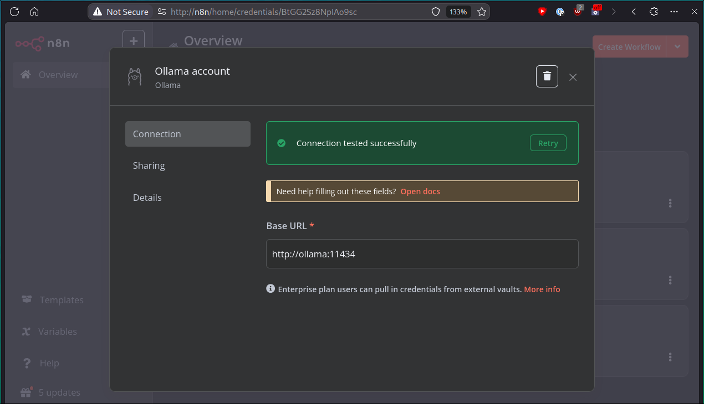

+++
title = "RAG – How I Made My 2nd Brain Talk Back"
date = "2025-02-25T16:55:55+01:00"
author = "DarkBones"
authorTwitter = "" #do not include @
cover = ""
tags = []
keywords = []
description = ""
showFullContent = false
readingTime = true
hideComments = true
draft = true
+++

<!-- TODO -->
[link to previous article explaining rag]

## RAG Problem #1: Context Blindness

To illustrate the problems with RAG, let's say my vector database holds detailed plots of my favorite movieseries. Let's pick two series that couldn't be further from each other: *The Matrix* and *The Lord of the Rings*. For illustration purposes, let's use a small chunk size and no overlap.

We have blindly split our movie plots into chunks and stored them in our vector database, along with their embeddings. We're even clever about it and split it up into sentences instead of `x` characters.

Now watch what might happen if you query the vector database with a question, and what it might return.

```
Input:  Who forged the one ring of power?
Output: [
  "Sauron forged the One Ring in Mount Doom to control Middle-earth.",
  "Neo is believed to be the One who will save humanity.",
  "The One Ring was made to enslave Elves, Dwarves, and Men.",
  "Agent Smith wants to destroy both humans and the Matrix.",
  "Sauron tricked the Elves and secretly made the One Ring."
]
```

```
Input:  Who or what was the Oracle in the Matrix?
Output: [
  "The Oracle is a program in the Matrix that guides Neo on his path."  
  "Galadriel, the Lady of Lothlórien, offers wisdom and foresight to the Fellowship."  
  "The Oracle helps humans understand their choices within the Matrix."  
  "Gandalf is a Maia, sent to Middle-earth to guide and counsel its people."  
  "The Oracle predicts the coming of the One who will end the war."  
]
```

If you give this information to an LLM and use it as context, it might end up answering the questions like this:

**Input:** *Who forged the one ring of power?*  

**LLM Response:**  
*The One Ring was forged by Sauron and Agent Smith to control Middle-earth and enslave Elves, Dwarves, and Men. Neo is believed to be the One who will save humanity, ignoring the other races. Sauron tricked the Elves into helping, while Agent Smith just wanted to destroy both humans and the Matrix.*

---

**Input:** *Who or what was the Oracle in the Matrix?*  

**LLM Response:**  
*The Oracle is a program in the Matrix that guides Neo on his path, much like Galadriel, the Lady of Lothlórien, who offers wisdom and foresight to the Fellowship. Together, they predict the coming of the One who will end the war, by throwing the Matrix into Mount Doom.*


**What happened here?**

*Garbage in, garbage out.* The vector database isn't designed to be smart. It's designed to take an input vector, sort its own vectors by most-similar, and return the top `x` items. It doesn't know what either of the movies are. In our second prompt, we even specifically ask about The Matrix. But if you've never seen the Matrix and don't know about the movie, how are you supposed to know which of these chunks belongs to which movie? The first chunk correctly answers the question, as there's literally an *Oracle* in the matrix, so that is the most similar chunk. But an oracle, by concept, offers wisdom and foresight. So, considering what little context the vector database has to work with, it's not *that* wrong to the conclude that Galadriel is also similar.

## RAG Problem #2: First Person Perspective Confusion

I write a lot in the first person. I write articles, technical documentation, tech talk preparations, emails, and I keep a professional diary with things I'm working on and achievements that I accomplished.

But also, I save a lot of content from other people who write in the first person. Articles I find interesting but don't have the time to read (yet), documentation of tools and applications that I'd like to be able to refer to. Neatly organized into directories and sub-directories they may be, but they all go into the same knowledge base, my 2nd brain.

But given the chunks *"I designed a robust data anomaly detection system."* and *"I climbed Mount Fuji in the least amount of steps."*, how is it supposed to know which one of those belongs to me (obviously it's the former, but a vector db doesn't know that).

## Solving Context Blindness by Making Chunks “Context Aware”

It's clear that storing individual chunks isn't going to cut it. Take a random chunk out of even a medium-sized document, and it's hard even for us humans to understand what the context is. So we need to make each chunk *context aware*.

Let's take a chunk from our example:

> The Oracle is a program in the Matrix that guides Neo on his path.

Here's what a *context aware* version of the chunk looks like:

```
<file_summary>
This file contains a detailed explanation of the Matrix film trilogy.
</file_summary>

<chunk_summary>
This chunk is about the Oracle and how she relates to Neo.
</chunk_summary>

<chunk_headers>
# The Matrix, ## The First Movie, ### Notable Characters, #### The Oracle
</chunk_headers>

<chunk_content>
The Oracle is a program in the Matrix that guides Neo on his path.
</chunk_content>
```

Even if you've never heard of The Matrix or The Oracle, this makes it clear how relevant the chunk is to a prompt like: *'Who or what was the Oracle in the Matrix?'*

*But how do we get these summaries and headers?*

We ask an LLM to summarize the entire file by providing the first and last few chunks-since intros and conclusions usually carry the strongest contextual clues. Then, using this file summary as a guide, we have the LLM create a chunk-specific summary, ensuring the chunk is tied back to the broader topic. And finally, we extract the markdown headers and include the chunk's content. We put all the pieces together and store it in a separate database field called *full_context*.

- **This *full_context* field is what we vectorize and embed.**
- **The original chunk content (augmented by the headers) is what the database returns**

By embedding the chunk along with its broader context, we help the RAG system understand where the chunk fits within the bigger picture. Instead of treating it as an isolated sentence, it now knows it’s part of a document about The Matrix, and that this specific chunk focuses on the Oracle’s role.

By storing the *"full context"* in a separate database field, it allows us to:
1. Check if the chunk we're processing is already in the database, so we don't have to ask an LLM to summarize it again.
2. Return the original chunk content to keep the resulting prompt as small as possible.

*Remember, this is not to benefit the LLM. This is to benefit the vector database and help it figure out where to put pieces of information, so the most relevant information can be returned.*

This simple addition of context isn’t just useful for decoding movie plots. In real-world scenarios—like legal document retrieval or technical knowledge bases, this strategy drastically reduces irrelevant results and hallucinations, leading to more accurate and trustworthy responses.

## Solving the First Person Confusion

This one is quite simple, and a little bit hacky. I have a directory in my knowledge base with my first name. If the chunk processor is processing any file in this directory or any of its sub-directories, I add an additional prompt instructing the LLM to replace all instances of *I*, *me*, *my* with my actual full name and to make it **"abundantly clear that this chunk is about me"**. And then when my prompt gets sent to the vector database to retrieve relevant chunks, it's also augmented with my name by simply prepending it.

> John Doe: What is my PB in the 5k?

Sure, this isn’t the most elegant fix, but it works. And when it comes to RAG systems, simple and effective often beats complex and fragile. By swapping out first-person pronouns with my full name in personal files, the system can now differentiate between my achievements and that travel blog I saved about climbing Mount Fuji.

## Setting it all up

To set up this system locally, we need a few ingredients:

- A database: *postgres*
- An LLM interface: *ollama*
- Some LLMs: *qwen2.5* / *deepseek-r1* / *llama3*
- An embedder: *nomic-embed-text*
- A way to interact with the LLM: *open-webui*
- A vector database: *Supabase*
- A RAG system: *darkrag* (my very own)
- A way to bring it all together: *n8n*

I run all of these different components using *docker*. If you're not familiar with *docker*, there are plenty of guides out there to get you started.

One important thing to note is that I configured all of my containers to run on a specified network named `ai-network`. This enables the different containers to talk to each other.

For my system (Arch Linux), I created daemons in my `~/systemd/.config/systemd/user/` directory, but you can easily adapt for whatever system you're using, be it Windows, Mac, or a different Linux distribution. I opted for running the containers separately, instead of in a large `docker-compose` setup, so I can easily enable/disable different components if I need to free up some memory.

### Setting up Ollama and downloading LLMs

You can spin up `ollama` using this command:

```
/usr/bin/docker run --rm \
    --network=ai-network \
    --name ollama \
    -v ollama_models:/root/.ollama/models \
    -p 11434:11434 \
    ollama/ollama:latest
```

Important to note that I created a volume named `ollama_models` and mapped it to `/root/.ollama/models` inside the container. This ensures that when we shut down the container, we don't have to re-download the models.

When **ollama** is running, run this command to go into the container:
`docker exec -it ollama /bin/bash`

Inside the container, run the `ollama pull` command to pull your desired language models. For this project, I recommend:
```
ollama pull qwen2.5
llama pull nomic-embed-text
```

Then run `exit` to go back to your local machine.

Personally, I run this docker container in this daemon that starts up automatically when I log into my machine:

```systemd
; systemd/.config/systemd/user/ollama.service
[Unit]
Description=Ollama AI Model Server
After=default.target
BindsTo=default.target

[Service]
ExecStartPre=-/usr/bin/docker network create ai-network
ExecStart=/usr/bin/docker run --rm \
    --network=ai-network \
    --name ollama \
    -v ollama_models:/root/.ollama/models \
    -p 11434:11434 \
    ollama/ollama:latest
ExecStop=/usr/bin/docker stop ollama
ExecStopPost=/usr/bin/docker rm ollama

Restart=always
RestartSec=5

[Install]
WantedBy=default.target
```

### Setting up Postgres

Several of the components that we are setting up require a database. Spinning up a postgres container is pretty straight-forward. Here's the command to spin up a postgres instance on your machine using docker:

```
/usr/bin/docker run --rm \
    --network=ai-network \
    --name=postgres \
    -p 5432:5432 \
    -v ~/Apps/postgres:/var/lib/postgresql/data \
    -e POSTGRES_USER=user \
    -e POSTGRES_PASSWORD=password \
    -e POSTGRES_DB=default_db \
    postgres:16-alpine
```

Just replace `user` and `password` with your desired postgres username and password.

### Setting up Open-Webui

Open-webui is a popular web interface for interacting with your local language models. It looks and feels very similar to what you're used to with ChatGPT.

<!-- TODO -->
[screenshot of open-webui]

You can easily run it with this command:

```
/usr/bin/docker run --rm \
    --network=ai-network \
    -e OLLAMA_BASE_URL=http://ollama:11434 \
    -e PORT=4080 \
    -p 4080:4080 \
    -v /mnt/SnapIgnore/AI/ollama/conversations:/app/backend/data \
    --name open-webui \
    ghcr.io/open-webui/open-webui:main
```

I have a directory on my local machine, `/mnt/SnapIgnore/AI/ollama/conversations` where I store the conversation data, but this can be any folder on your local machine that you prefer.

You also need to set up a *"Function"* in open-webui to intercept your prompts and augment them with data from your knowledge base. In your browser, navigate to `http://localhost:4080`, then to `Settings > Admin Panel > Functions` and create a new function. Don't forget to enable the function by clicking on the 3 dots next to the function name, and enabling *Global* to enable the function for all your model conversations. Alternatively, you can enable the function separately for each model by going into the model settings.

Here's the function I use in my system:

[Open-Webui Webhook Function](https://github.com/DarkBones/darkrag/blob/main/open-webui-webhook-function-example.py)

### Setting up Supabase

Running **Supabase** locally and configuring it to work with this project is a bit more involved, but should be doable. You can follow their official guide here:

[Self-hosting Supabase with Docker](https://supabase.com/docs/guides/self-hosting/docker)

Once you have the `docker-compose` file for **Supabase**, you need to configure all the services in it to use our `ai-network` network so our other docker containers can see it. Here's my `docker-compose.yml` file for **Supabase**:

[Supabase customized docker-compose](https://github.com/DarkBones/darkrag/blob/main/supabase-docker-compose-example.yml)

For my own setup, I cloned the **Supabase** repository in my `~/Apps` directory and run it with this daemon:

```systemd
; systemd/.config/systemd/user/supabase.service
[Unit]
Description=Supabase
After=docker.service
BindsTo=default.target

[Service]
ExecStartPre=-/usr/bin/docker network create ai-network || true
ExecStart=/usr/bin/docker compose -f ~/Apps/supabase/docker/docker-compose.yml up
ExecStop=/usr/bin/docker compose -f ~/Apps/supabase/docker/docker-compose.yml down

Restart=always
RestartSec=5

[Install]
WantedBy=default.target
```

Notice the line where it says `ExecStartPre=-/usr/bin/docker network create ai-network || true`. This ensures that the docker network `ai-network` is created. If you try to create a network that already exists, docker throws an error, so appending `|| true` ensures this is handled gracefully.

#### Configuring Supabase

Once you have **Supabase** set up and running, it's time to configure it. You can go to your **Supabase** instance by navigating to `http://localhost:8000` in your browser. It will ask you for your username and password, you can find these credentials in the `.env` file of the **Supabase** repository you downloaded.

Then, go to *SQL editor* in the left navigation bar and run this command to create the `documents` table:

```sql
CREATE SEQUENCE documents_id_seq;

CREATE TABLE documents (
    id BIGINT PRIMARY KEY DEFAULT nextval('documents_id_seq'),
    content TEXT,
    metadata JSONB,
    embedding VECTOR(768),
    content_hash TEXT DEFAULT 'placeholder'::text,
    summary TEXT DEFAULT 'placeholder'::text,
    full_context TEXT DEFAULT 'placeholder'::text
);
```
You can set up several tables with different names, if you want to have multiple knowledge-bases. My *darkrag* tool supports having multiple tables.

Aside from a table to store your embeddings in, you also need a way to query them by similarity. Run this command in the *SQL editor* to create the function to match embeddings by cosine similarity:

```sql
create or replace function match_documents(
  query_embedding vector,
  match_count int
) returns table (
  id uuid,
  content text,
  metadata jsonb,
  similarity double precision
) language plpgsql as $$
begin
  return query
  select
    id,
    content,
    metadata,
    1 - (documents.embedding <=> query_embedding) as similarity
  from documents
  order by documents.embedding <=> query_embedding
  limit match_count;
end;
$$;
```

We also need a way to remove data from the database by the *"file_path"* key in the metadata. This way we can avoid having duplicate entries for the same documents. Run this in the *SQL editor* to create that function:

```sql
create or replace function delete_documents_by_path(
  target_path text
) returns void 
language plpgsql as $$
begin
  delete from documents 
  where metadata->>'file_path' = target_path;
end;
$$;
```

That was... a lot... But your **Supabase** instance should be ready now. Let's move onto setting up *darkrag*.

## Setting up darkrag

I made the *darkrag* system as easy as possible to set up. First, run this command to pull the image:

```
docker pull darkbones/darkrag:latest
```

Then, create an `.env` file somewhere on your system (E.g. `~/Apps/darkrag/.env`) and open it with your favorite text editor. Here's an example `.env` file:

```sh
# .env
DEFAULT_DATABASE_TABLE=documents
AUTHOR_NAME=John
AUTHOR_FULL_NAME="John Doe"
AUTHOR_PRONOUN_ONE=he
AUTHOR_PRONOUN_TWO=him

SUPABASE_URL=http://kong:8000
SUPABASE_KEY=your-supabase-key-as-found-in-your-supabase-env-file

OLLAMA_URL=http://ollama:11434
DEFAULT_MODEL=qwen2.5:7b
EMBEDDING_MODEL=nomic-embed-text:latest
```

*Important variables:*
- `AUTHOR_NAME`: For any file in the `AUTHOR_NAME` directory, or any of its sub-directories, *darkrag* will prompt the chunk summarizer to replace all first-person references like *"I"* or *"me"* with your full name, to solve the *"first-person confusion problem"*. For example, if a file in `your-knowledge-base-directory/John/about-john.md` contains `I like trains`, the chunk summarizer will add something like *"John Doe likes trains"* to the contextualized summary of the chunk.
- `AUTHOR_FULL_NAME`: Your full name so *darkrag* can contextualize first-person chunks.
- `AUTHOR_PRONOUN_ONE` & `AUTHOR_PRONOUN_TWO`: Needed for the prompt to contextualize first-person chunks.
- `SUPABASE_KEY`: Needed to connect to the **Supabase** instance. You can find this key in your `.env` file of **Supabase**.
- `DEFAULT_MODEL`: The LLM that will summarize the chunks. I recommend `qwen2.5:7b` as it's light-weight and accurate enough.

Replace the variables with actual values as needed.

Finally, run this command to run *darkrag*:

```
docker run -p 8004:8004 --env-file [path-to-your-env-file] darkbones/darkrag:latest

docker run --rm \
  --network=ai-network
  --name=darkrag
  -v /mnt/SnapIgnore/AI/knowledge:/data
  -p 8004:8004
```

Just remember to replace `[path-to-your-env-file]` with the actual path to your `.env` file you created above. If you prefer, you can also provide the environment variables in the `docker-run` command directly if you prefer that over using an `.env` file.

### Setting up n8n

Now that we have all the individual pieces of the puzzle, it's time to put everything together. If you're not familiar with *n8n*, it's a powerful, low-code workflow automation tool that allows you to connect various apps, services, and APIs to streamline processes and automate tasks efficiently.

This is the command I run to spin it up (in a daemon):

```
/usr/bin/docker run --rm \
    --network=ai-network \
    --name=n8n \
    -p 5678:5678 \
    -v ~/Apps/n8n:/home/node/.n8n \
    -v /mnt/SnapIgnore/AI/knowledge:/home/knowledge \
    -e N8N_BASIC_AUTH_ACTIVE=true \
    -e N8N_BASIC_AUTH_USER=admin \
    -e N8N_BASIC_AUTH_PASSWORD=yourpassword \
    -e DB_TYPE=postgresdb \
    -e DB_POSTGRESDB_HOST=postgres \
    -e DB_POSTGRESDB_PORT=5432 \
    -e DB_POSTGRESDB_DATABASE=n8n \
    -e DB_POSTGRESDB_USER=user \
    -e DB_POSTGRESDB_PASSWORD=password \
    -e N8N_SECURE_COOKIE=false \
    n8nio/n8n:latest
```

*Important components:*
- `-v` maps a directory on your local machine (can be any directory you wish) to the `/home/knowledge` directory on *n8n*. This allows *n8n* to see the files in that directory so you can automatically update the knowledge base if you add or change any file in this directory.
- `N8N_BASIC_AUTH_USER`: change this to your desired username for *n8n*
- `N8N_BASIC_AUTH_PASSWORD`: change this to your desired password for *n8n*
- `DB_POSTGRESDB_USER`: change this to the username you set up when setting up Postgres
- `DB_POSTGRESDB_PASSWORD`: change this to the password you set up when setting up Postgres

#### Configuring n8n

First, you need to configure some credentials to allow *n8n* to talk to your other services like *ollama* and *Supabase*. Setting them up is pretty easy. In your *n8n* dashboard (`http:localhost:5678`), got to the *Credentials* tab and click on *New Credential*. Select the credential you want to add from the drop-down and follow the steps.




I have 3 workflows in *n8n*:

1. *Knowledge Base Updater*: Updates the database whenever I add, change, or delete a file in the knowledge base.
2. *Knowledge Base Rebuilder*: Periodically runs through all the files in the knowledge base to make sure the vector database is up to date.
3. *RAG Webhook*: Takes a user prompt, and returns the 5 most relevant chunks.

Let's set them up one-by-one.

**Knowledge Base Updater**

This workflow has 2 sets of three nodes; one set for when a file is added or updated, another for when a file is deleted:


The file updated entry node is configured like so:


Remembered how we mapped a directory on our local machine to `/home/knowledge` in `n8n`? We're using that here!

The code in the two `Code` nodes are identical:

```javascript
const paths = [];
for (const item of $input.all()) {
  paths.push(item.json.path.replace(/^\/home\/knowledge\//, ""));
}

return { paths };
```

It just removes *"/home/knowledge/"* from the start of the path, to match with what *darkrag* expects.

And the two *Http Request* nodes:


**Knowledge Base Rebuilder**

This runs once a week to make doubly sure all the knowledge in the database is up to date.


First, it deletes files from the database that are no longer present in the knowledge base.


Then, it processes all files in the knowledge base to make sure all the information in the knowledge base is also in the database.


**RAG Webhook**

Finally, we configure our actual webhook. It's another pretty simple *n8n* workflow:


It contains only a couple of nodes. Here's the configuration for **Supabase**:


And the code inside the *Code* node that extracts the knowledge and prepares the request to **darkrag**:

```javascript
const knowledge = [];

for (const item of $input.all()) {
  const relPath = item.json.document.metadata.file_path.replace(/^\/home\/knowledge\//, ""));
  const content = item.json.document.pageContent;
  knowledge.push({
    file_path: relPath,
    content: content,
  });
}

return { knowledge }
```

And as a final step, return what *darkrag* responds with:


## Conclusion

That's it! Those are all the ingredients to set up your own 100% local, 100% free *RAG System*. Now when you interact with your favorite model in *open-webui* the following happens:

1. The *open-webui* function intercepts your message and sends it to the webhook in *n8n*
2. *n8n* sends your input to *Supabase*
3. *Supabase* responds with the 5 most relevant chunks
4. The *open-webui* function adds those chunks as context
5. The LLM responds more accurately to your input

And when you add, change, or delete a document from your knowledge base:

1. *n8n* sends the file path to *darkrag*
2. *darkrag* adds more context by summarizing the chunks, and stores the embeddings of contextualized version, along with the original data, on *Supabase*
